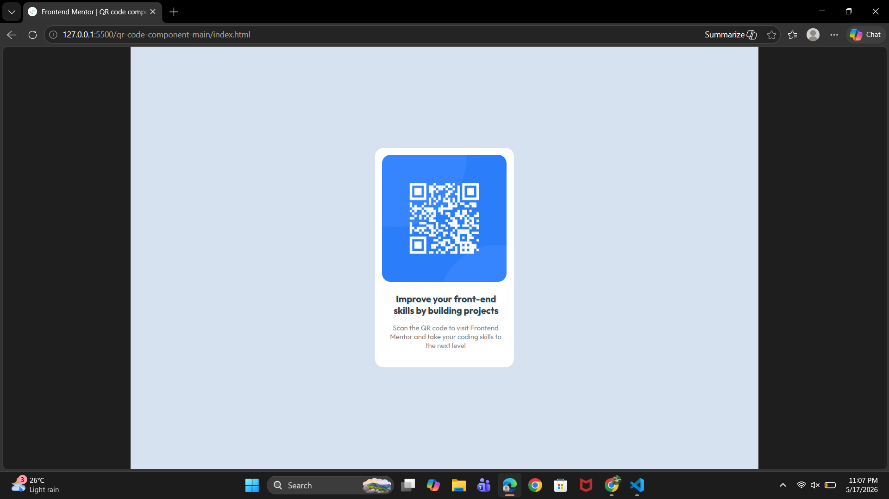

# Frontend Mentor - QR Code Component

This is my solution for the QR Code Component challenge from Frontend Mentor.  
This project helped me improve my frontend development skills and understand how to create clean and responsive layouts using HTML and CSS.

## Overview

The goal of this project was to recreate the QR code card design as accurately as possible.  
I practiced alignment, spacing, text styling, and responsive design while building this project.

## Built With

- HTML5
- CSS3
- Flexbox

## What I Learned

Through this project, I learned:
- How to structure a webpage using HTML
- How to center elements using Flexbox
- How to manage spacing using margin and padding
- How to create a responsive card layout
- Basic debugging and layout fixing techniques

## Continued Development

In future projects, I want to improve my:
- Responsive design skills
- CSS positioning knowledge
- JavaScript Fundamentals
- Flexbox and Grid understanding
- Frontend development experience

## Output

